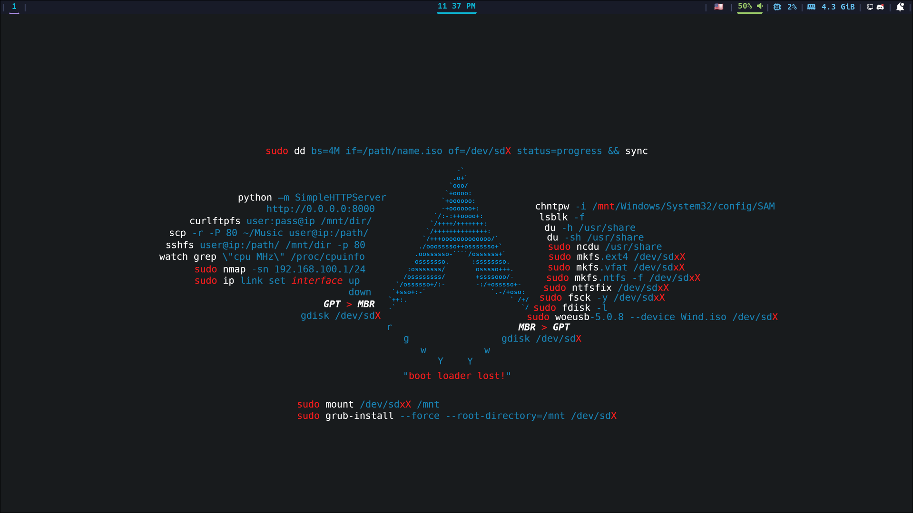
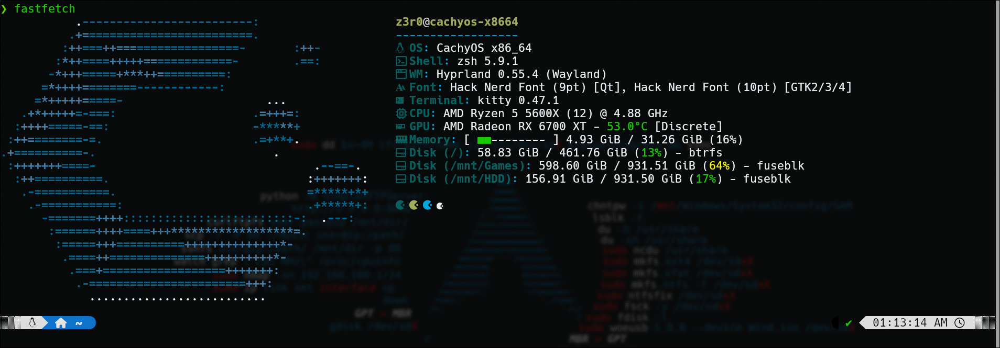

   <h1>Dotfiles</h1>

  
  
  
  

---

<h2 align="center">Overview</h2>

  
<b>Desktop</b>

   

  

 <h2 align="center">Terminal</h2>

  
<b>Fastfetch</b>

   

  

Stack Overview

<h2>Stack</h2>

| Component | Description |
| --- | --- |
| cachyOS | Linux Distro |
| Hyprland | Dynamic tiling Window Manager |
| Waybar | Custom status bar |
| SwayNC | Notifications |
| Rofi | App Launcher |
| Kitty | Terminal |
| Yazi | File Manager |
| Nvim | Custom lua config |

---

<h2 align="center">Support</h2>

If you like this setup, feel free to star the repo :)
