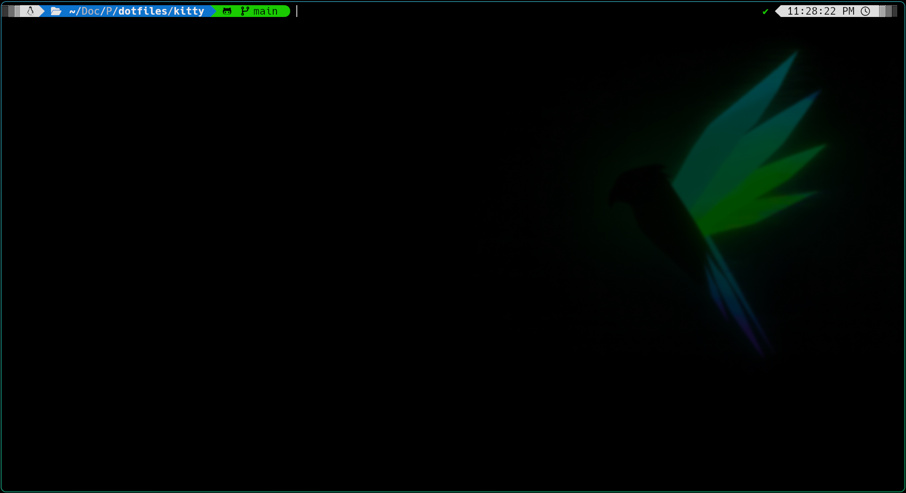

  <h1>Kitty Terminal</h1>

---

<h2>Overview</h2>

  
Kitty Screenshot

  

---

<h2>Installed Plugins</h2>

<article>

As of now, I've styled and configured `Kitty` using <a href="https://github.com/romkatv/powerlevel10k" target="_blank" alt="Powerlevel10k GitHub Page">Powerlevel10k</a>

</article>
